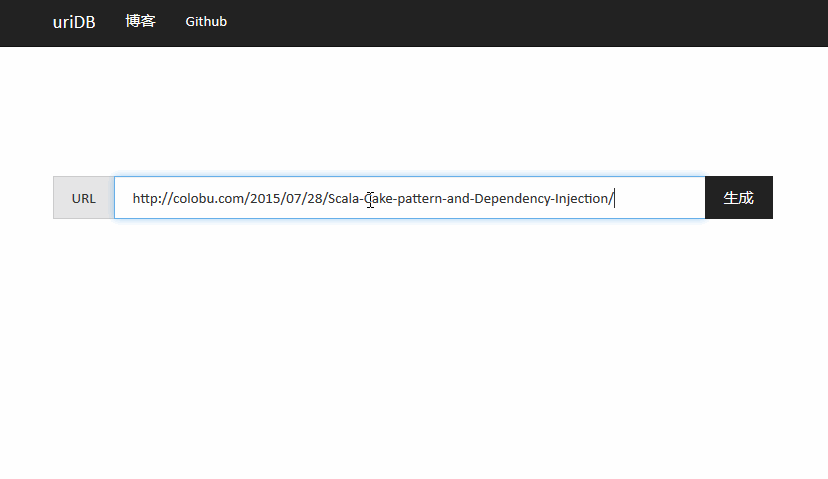

# 短地址服务器
本项目实现了一个可扩展的高性能的服务器。

## 项目依赖
正常安装部署时，短地址应用依赖以下的软件：

* [Java](http://www.oracle.com/technetwork/java/javase/downloads/index.html): 后台服务器使用[Scala]()语言实现。 它是运行在JVM的一个高级语言
* [Nginx](http://nginx.org/) (可选): 高性能的web服务器，用做负载平衡。
* [MongoDB](https://www.mongodb.org/): 文档型的NoSQL服务器，用来保存段地址和实际地址的映射
* [Memcahced](http://memcached.org/) (可选): 缓存服务器。缓存短地址映射关系，减轻MongoDB数据库的压力

## 扩展规模
你可以使用最小配置部署一台机器测试短地址服务，但是对于短地址的业务来说，你肯定面临的是一个地址创建和访问量巨大的需求。因此，你可以根据业务的增长调整一下的配置：
### 短地址后台服务器
根据访问的规模动态的扩展短地址后台服务器。因为服务器的设计是无状态的，你可以很方便的进行扩展。

### 负载平衡
你可以部署主从模式的**Nginx**服务器作为负载均衡器。比如通过keepalived实现两台Nginx的双机热备功能。

### 数据库
可以搭建**MongoDB**集群，因为产生的地址巨大，可以根据短地址ID进行分区。

### 缓存  
可以搭建多台**Memcached**服务器。

更多的安装和设计文档可以参考 [Wiki](https://github.com/smallnest/shorturl/wiki)